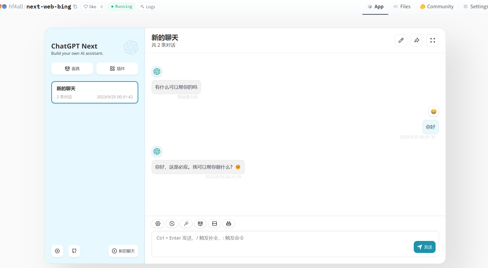

# Bingo OpenAI 

为了方便将 `new bing` 接入到其他 `gpt` 类的项目，现开放 `OpenAI` 格式的 `API` 接口供大家调用。

## 接口说明
### 入参
 * url: /openai/chat/completions (PS: 为了方便兼容不同的项目，所有以 `/completions` 结尾的请求都会被支持)
 * Content-Type: application/json
 * 参数说明
    * messages 输入的消息列表，完整格式参见 https://platform.openai.com/docs/guides/gpt/chat-completions-api
    * model 模型名称（此字段被用于指定 new bing 风格，参数为 Creative、Balanced、Precise 中的一种）
    * stream 是否使用流式输出，默认为 
    
### 出参
  * Content-Type: application/json 或者 text/event-stream
  * 参数说明
    * choices 返回的消息内容，完整格式参见 https://platform.openai.com/docs/guides/gpt/chat-completions-response-format
    * id 会话 ID，如需保持上下文，则需要传入此参数，否则会丢失上下文

### 示例
以下以 `curl` 为例
```
curl -kL 'https://copilot.github1s.tk/api/v1/chat/completions' \
  -H 'Content-Type: application/json' \
  -d '{
    "messages":[{"role":"user","content":"你好"}],
    "stream":true,
    "model":"Creative"
  }' \
--compressed
```

### 限制
 * 暂时只支持聊天(`/completions`)接口，其他接口如有需求，请在 [issue](https://github.com/weaigc/bingo/issues) 提出
 * 受 new bing 限制，暂不支持自定义历史记录

## 调用方式
除了使用 HTTP POST 请求来调用之外，你也可以使用自己熟悉的方式来调用 new bing，如 python 的 openai 库或其它语言的同名包。下面例举一下 Python 和 Node.js 的用法

### Python
```
import openai
openai.api_key = "dummy"
openai.api_base = "https://copilot.github1s.tk" # 这里可以改为你自己部署的服务，bingo 服务版本需要 >= 0.9.0

# create a chat completion
chat_completion = openai.ChatCompletion.create(model="Creative", messages=[{"role": "user", "content": "Hello"}])

# print the completion
print(chat_completion.choices[0].message.content)
```

流式输出
```
import openai
openai.api_key = "dummy"
openai.api_base = "https://copilot.github1s.tk" # 这里可以改为你自己部署的服务，bingo 服务版本需要 >= 0.9.0

# create a chat completion
completion = openai.ChatCompletion.create(model="Creative", stream=True, messages=[{"role": "user", "content": "Hello"}])
for chat_completion in completion:
    # print the completion
    print(chat_completion.choices[0].message.content, end="", flush=True)

```

> 更多使用说明参考 https://github.com/openai/openai-python

### Node.js
```
import OpenAI from 'openai';

const openai = new OpenAI({
  baseURL: 'https://copilot.github1s.tk' // 这里可以改为你自己部署的服务，bingo 服务版本需要 >= 0.9.0
});

async function main() {
  const stream = await openai.chat.completions.create({
    model: 'Creative',
    messages: [{ role: 'user', content: 'Hello' }],
    stream: true,
  });
  for await (const part of stream) {
    process.stdout.write(part.choices[0]?.delta?.content || '');
  }
}

main();
```
> 更多使用说明参考 https://github.com/openai/openai-node


## 在线演示

1. https://huggingface.co/spaces/hf4all/chatbot-ui-bing [](https://huggingface.co/login?next=%2Fspaces%2Fhf4all%2Fchatbot-ui-bing%3Fduplicate%3Dtrue%26visibility%3Dpublic)
2. https://huggingface.co/spaces/hf4all/chatgpt-next-web-bing 
[](https://huggingface.co/login?next=%2Fspaces%2Fhf4all%2Fchatgpt-next-web-bing%3Fduplicate%3Dtrue%26visibility%3Dpublic)


[](https://huggingface.co/spaces/hf4all/chatgpt-next-web-bing)
