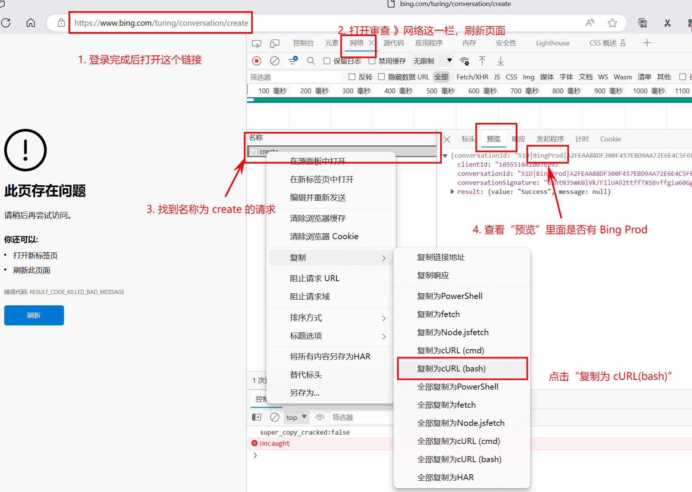

<div align="center">

# Bingo 

Bingo，一个让你呼吸顺畅 New Bing。

高度还原 New Bing 网页版的主要操作，国内可用，兼容绝大多数微软 Bing AI 的功能，可自行部署使用。


[](https://hub.docker.com/repository/docker/weaigc/bingo/)
[](https://hub.docker.com/repository/docker/weaigc/bingo/)
[](https://github.com/weaigc/bingo/blob/main/license)

</div>

## 演示站点

站点1(V2)：https://bing.github1s.tk

站点2(V1): https://copilot.github1s.tk

站点3(代理)：https://bingo.weaigc.repl.co(此模式不再推荐使用)


[](https://bing.github1s.tk)

## 功能和特点

- 支持无限次数对话
- 支持任意地方访问
- 支持 Docker 构建，方便快捷地部署和访问
- Cookie 可全局配置，全局共享
- 支持持续语音对话
- 支持免账号使用
- 完全免费
- 支持 OpenAI 方式调用 [使用文档](./OPENAI.md)
- 支持独立部署

## RoadMap
 - [x] 支持 wss 转发
 - [x] 支持一键部署
 - [x] 优化移动端展示
 - [x] 支持画图
 - [x] 支持语音输入(支持语音指令，目前仅支持 PC 版 Edge 及 Chrome 浏览器)
 - [x] 支持语音输出(需要手动开启)
 - [x] 支持识图（gpt4模式及预设人格模式不支持）
 - [x] 支持自定义域名
 - [x] 支持离线访问
 - [x] 适配深色模式
 - [x] 支持历史记录
 - [x] 支持内置提示词
 - [x] 支持 Workers 部署
 - [x] 支持 OpenAI API
 - [x] 支持 GPT4 模式
 - [ ] 国际化翻译

## 在线部署
#### 部署到 CodeSandbox（推荐）
点击 [](https://codesandbox.io/p/devbox/github/weaigc/bingo/tree/main?import=true)，点击右上角 “Fork”，然后一路点 “Next” 即可（没有注册账号的注册完账号后重试即可）。

#### 部署到 Render
感谢 [@SokWith](https://github.com/SokWith) 测试，Render 目前已复活。
为了防止封号，一键部署不再提供，请前往 https://render.com 手动部署。

### 代理模式（不推荐）
当前面的方式都不能用的时候，可以使用代理模式，然后将域名解析到自己的服务器上，做为折中的办法继续使用。
#### 1. 部署到 Replit（推荐）

[点击部署Replit](https://replit.com/@weaigc/bingo?v=1)

#### 2. 部署到 CloudFlare (需要有自己的域名才可以)

- [注册 Cloudflare 账号](https://dash.cloudflare.com/sign-up)

- 添加一个新的网站，需要你有自己的域名并且将域名`Name Server`托管给 Cloudflare 才行（更多信息可自行 Google)

- 通过左侧菜单进入「Workers」，并点击「Create a Worker」。

- 创建 Worker 服务，复制 [worker.js](./cloudflare/worker.js) 全部代码粘贴至创建的服务中，保存并部署。

- 触发器 中自定义访问域名。

### 部署其它平台
<details>
<summary>
<del>以下为已经被封杀的部署方式</del>

V2 版本已解决此问题，详见: https://github.com/weaigc/bingo/tree/v2
</summary>

#### 部署到 HuggingFace
1. 点击此图标
[](https://huggingface.co/login?next=%2Fspaces%2Fhf4all%2Fbingo%3Fduplicate%3Dtrue%26visibility%3Dpublic)，配置可以不改。

2. 部署署完成后，点击“设置” 》“站点域名”，点一下，复制一下 HF 域名信息，然后分享给别人即可。


#### 部署到 Netlify
[](https://app.netlify.com/start/deploy?repository=https://github.com/weaigc/bingo)

#### 部署到 Vercel
如果你是 Vercel 付费用户，可以点以下链接一键部署到 Vercel。免费版本有[接口超时限制](https://vercel.com/docs/concepts/limits/overview)，不推荐使用

[](https://vercel.com/new/clone?demo-title=bingo&demo-description=bingo&demo-url=https%3A%2F%2Fbing.github1s.tk%2F&project-name=bingo&repository-name=bingo&repository-url=https%3A%2F%2Fgithub.com%2Fweaigc%2Fbingo&from=templates&skippable-integrations=1&env=BING_HEADER&envDescription=%E5%A6%82%E6%9E%9C%E4%B8%8D%E7%9F%A5%E9%81%93%E6%80%8E%E4%B9%88%E9%85%8D%E7%BD%AE%E8%AF%B7%E7%82%B9%E5%8F%B3%E4%BE%A7Learn+More&envLink=https%3A%2F%2Fgithub.com%2Fweaigc%2Fbingo%2Fblob%2Fmain%2F.env.example)

</details>

## 环境和依赖

- Node.js >= 18
- New Bing 的[用户信息](#如何获取-BING_HEADER))
- 一台没有被微软封禁的 vps（需要自行测试）


## 安装和使用

> 本地部署需要你本机或服务器 IP 是国外 IP，且没有被微软封禁 ，否则无法正常使用 New Bing。

* 使用 Node 启动

```bash
git clone https://github.com/weaigc/bingo.git
npm i
cd bingo
npm run build
npm run start
```

* 使用 Docker 启动
```bash
docker pull weaigc/bingo
docker run --rm -it -p 7860:7860 weaigc/bingo
# 如果不能正常使用，可以尝试设置环境变量 BING_HEADER
docker run --rm -it -e BING_HEADER=xxxx -p 7860:7860 weaigc/bingo
# 如果还是不行，可以尝试 proxy 模式
```

## 如何获取 BING_HEADER
> 配置了 BING_HEADER 意味着你将自己的账号共享给所有使用此服务的人，如果不需要免登录画图的功能，不建议设置此变量

打开 https://www.bing.com 并登录，然后访问 https://www.bing.com/turing/captcha/challenge ，通过人机校验（如果显示**无效域**，则跳过校验不管），然后



> 复制出来的内容应该如下所示。确认格式无误后，打开 https://bing.github1s.tk/#dialog=%22settings%22 ，粘贴进去，点击“转成 BING_HEADER 并复制”，然后从剪切板粘贴即可得到。（你也可以先在网页上进行验证）

以下是格式参考，需要注意的是，网页端保存的格式是以`curl`开头, 而服务端配置的 `BING_HEADER` 是 `base64` 格式，两者不能互通。
<details>
<summary>正常格式/网页端保存的格式(格式仅供参考)</summary>

```
curl 'https://www.bing.com/turing/captcha/challenge' \
  -H 'authority: www.bing.com' \
  -H 'accept: text/html,application/xhtml+xml,application/xml;q=0.9,image/webp,image/apng,*/*;q=0.8,application/signed-exchange;v=b3;q=0.7' \
  -H 'accept-language: zh-CN,zh;q=0.9,en;q=0.8,en-GB;q=0.7,en-US;q=0.6' \
  -H 'cache-control: max-age=0' \
  -H 'cookie: MicrosoftApplicationsTelemetryDeviceId=3399c004-fd0e-48ec-bb92-d82a27b2bbd4; _EDGE_V=1; SRCHD=AF=NOFORM; SRCHUID=V=2&GUID=29EBDDA4E6674329ACCF1A0A423C3E98&dmnchg=1; _UR=QS=0&TQS=0; _HPVN=CS=eyJQbiI6eyJDbiI6MSwiU3QiOjAsIlFzIjowLCJQcm9kIjoiUCJ9LCJTYyI6eyJDbiI6MSwiU3QiOjAsIlFzIjowLCJQcm9kIjoiSCJ9LCJReiI6eyJDbiI6MSwiU3QiOjAsIlFzIjowLCJQcm9kIjoiVCJ9LCJBcCI6dHJ1ZSwiTXV0ZSI6dHJ1ZSwiTGFkIjoiMjAyMy0wNy0yNVQwMDowMDowMFoiLCJJb3RkIjowLCJHd2IiOjAsIkRmdCI6bnVsbCwiTXZzIjowLCJGbHQiOjAsIkltcCI6Mn0=; _RwBf=ilt=1&ihpd=1&ispd=0&rc=0&rb=0&gb=0&rg=200&pc=0&mtu=0&rbb=0&g=0&cid=&clo=0&v=1&l=2023-07-25T07:00:00.0000000Z&lft=0001-01-01T00:00:00.0000000&aof=0&o=2&p=&c=&t=0&s=0001-01-01T00:00:00.0000000+00:00&ts=2023-07-25T11:00:31.7111548+00:00&rwred=0&wls=&lka=0&lkt=0&TH=&dci=0; ANON=A=0043C6590EA808ED6E395059FFFFFFFF&E=1c8b&W=1; NAP=V=1.9&E=1c31&C=DnaMSbDN_4efZ_xXqBF3Daorjr53kYqYoaP8YHsupjmiXnysX7a37A&W=1; PPLState=1; KievRPSSecAuth=FABSBBRaTOJILtFsMkpLVWSG6AN6C/svRwNmAAAEgAAACMGUA7EGVSjGEAQBGHtNsc5sNL7unmJsfPJ2t6imfo4BeUJlAia3IpMTtMUy4PU/C5QAzRI5pODtsIee0+blgllXt/5IiWwGjwmdhivsFM597pRPkjARPfwsPhNLPNbJrCPNPHdje4Is78MnCADXw6/NBq2FL8V2/byw2fH6IuAMD2MvN/VvqpEa9ZxiDjZtENj4HEj0mO2SgzjfyEhVAkjvznJqU2rw/Q2tHmX94NAM2kzlzKF/hWPhCCUmu8IHLvCnHDS6mSptvJDDP/sp3ovtzOXkP1mlM/Xju5ftesUvccVEQGffXORa1dE5hEMbKIiKXz1tDdduSXE19g9/+mRMAjaQhpwhI8XmilCTx1adb1Ll5qK+VjC9GNfEZzcbsGBPVaOl+anG8rEMq+Xnhjo7J+NqTNolavHgcuV8kJsCeJZIged33UA8eOZeFo+wAECMguxMoSqgpGH+sthqynvD/FJD6r/tiU2N3uqVq8NE8V37asrN6T14Z0FGBJOe6ET1+PGApm3s11OY9/xhFEB9T5BEPUGEbvRcLcW2ncFQX0EU+xweiPqo1Q1hNUg/dCtSI+lZ7c2H8XheePZavZ0TJQ8oNCSAuKiTqJmI0fVGpwbXwfaADkEipuawz3fIuMJBNgMU0OtA7Hm59v2fGLIBuvi6YeKS6GgVk3BIPf+P/eKahwozrxQZaFnoHTSqMkvct7xCP4atBROfXKf5Ww0CcFKp+2WX9BIskTOo2jjk6bAyyYJ+ElUB1fgLKNk5m/YSMc9iYCLIBMIGN8F0Yvy3tZ7cvh7Ue5Klo98US/I+nW1G7ZJMHRgUO8h8lpneHqEMegKd8gynO4VF7RpCjJkunDmW0Ta+RkXAP619pg0dqHMFkoOgknN78oBbGTV6fJUKotv+vi61kLhAeXZGWoHGCRXh2wUC6YgfPgKA6ESRNHtFn7E5B3HHpLc5rVMDSNhKZYfdhupV4Ezf6+5DhMcZLZhi0kk+ivDiN1gdHlVtSN55xpvf+c+XZDzR0uhgcvgy0LAbmzgk6y4WbYH+LQsMpzNNj+aC72vMiWovWrKh9jY4MYCmdgxsS/skPtLdp18muiEIRXTbZQGUmhxFpJAIbBIsCscMpzL0BgeujxUwM5wr79Sd9r4xwbgSMwmBlBfUHRVBdNyg8feepeJbCS63nD6eHOuLqMRsPIio3w/ki/EAa92UUEiZeavLsMUD/y/qAvWUdzdP5Y+C/TM+CMGS/kGL4LEdY/28MQeTvU1qv1X21kQt2aiaj3pPVL36hAzxbcLgqcMo9oymDRy87kdCXW/+g4oKLtMh6fm/G6W6Y/B01JlxohyyvueHQIG557uzkEkTJ3FnOVODSKBKpb3WZ65rExfV71zSZa25F3GmpaIG6HiYrX2YYhQAkIE9pKEQBHbnwHuwNDGottZTXZw=; WLS=C=9df3f9d8518fae19&N=wen; WLID=pGY8HgWCu4p5XYCOk2oa0+DBdftkMUfmNIn8XtSjSTKsgv/Il7GUlYs0Jpjf/E12jZMgV7x44Dy3fXOgjjUoJx7Y/ClLrLhsk20THksJJoI=; _EDGE_S=F=1&SID=17CF6EE006426448213C7DB907436588&mkt=zh-CN; MUID=225621093D8A6C27301632413C0E6D08; MUIDB=225621093D8A6C27301632413C0E6D08; SUID=A; SNRHOP=I=&TS=; _U=nGyzKQruEsDwLiu65fZFIG6e12hf2lwTJmroW__k8joUJIKmG3OIjayXKGW9dCVR3sNhF76mEVxyW6yjUGPodOfjtSa3s3J_DxMOrEK1BqXCOBI9bC66spAIASV7prsYFlVAJz73jVNENp_tBubLHJy6EbT0BKRe4AjrYkH-9uMnmCKB8Zmyg; _SS=SID=17CF6EE006426448213C7DB907436588&R=0&RB=0&GB=0&RG=200&RP=0&PC=U531; SRCHS=PC=U531; USRLOC=HS=1&ELOC=LAT=22.501529693603516|LON=113.9263687133789|N=%E5%8D%97%E5%B1%B1%E5%8C%BA%EF%BC%8C%E5%B9%BF%E4%B8%9C%E7%9C%81|ELT=2|&CLOC=LAT=22.50153029046461|LON=113.92637070632928|A=733.4464586120832|TS=230726151034|SRC=W; SRCHUSR=DOB=20230725&T=1690384908000&POEX=W; ipv6=hit=1690388509974&t=6; SRCHHPGUSR=HV=1690384945&SRCHLANG=zh-Hans&PV=15.0.0&BRW=MW&BRH=MT&CW=410&CH=794&SCW=410&SCH=794&DPR=1.5&UTC=480&DM=0&WTS=63825879627&PRVCW=410&PRVCH=794&PR=1.5; cct=AjWIBYOoVP-Afq6gWwtx80If6yHn6iBuEVHA1XHdAKpny6Y_CVyi_MSyM94VyMWnjdYkkccVtm3czoIAtXUGQA; GC=AjWIBYOoVP-Afq6gWwtx80If6yHn6iBuEVHA1XHdAKpR3Y_D9Ytcks4Ht6XhadXk75dvhzP4YOUS0UmoEyqyxw' \
  -H 'dnt: 1' \
  -H 'sec-ch-ua: "Chromium";v="116", "Not)A;Brand";v="24", "Microsoft Edge";v="116"' \
  -H 'sec-ch-ua-arch: "x86"' \
  -H 'sec-ch-ua-bitness: "64"' \
  -H 'sec-ch-ua-full-version: "116.0.1938.29"' \
  -H 'sec-ch-ua-full-version-list: "Chromium";v="116.0.5845.42", "Not)A;Brand";v="24.0.0.0", "Microsoft Edge";v="116.0.1938.29"' \
  -H 'sec-ch-ua-mobile: ?0' \
  -H 'sec-ch-ua-model: ""' \
  -H 'sec-ch-ua-platform: "Windows"' \
  -H 'sec-ch-ua-platform-version: "15.0.0"' \
  -H 'sec-fetch-dest: document' \
  -H 'sec-fetch-mode: navigate' \
  -H 'sec-fetch-site: none' \
  -H 'sec-fetch-user: ?1' \
  -H 'sec-ms-gec: B3F47AD4A283CAB374C0451C46AAFD147C6A4DACAFF6A1C13F34B2C72B024494' \
  -H 'sec-ms-gec-version: 1-116.0.1938.29' \
  -H 'upgrade-insecure-requests: 1' \
  -H 'user-agent: Mozilla/5.0 (Windows NT 10.0; Win64; x64) AppleWebKit/537.36 (KHTML, like Gecko) Chrome/116.0.0.0 Safari/537.36 Edg/116.0.0.0' \
  -H 'x-client-data: eyIxIjoiMiIsIjEwIjoiXCJTMGg3R05HOTF2aDQ1TUZSUnZ5NHN2akRmMWdlaVJKenNxNlA3aU1WbnF3PVwiIiwiMiI6IjEiLCIzIjoiMSIsIjQiOiIyMTU4ODQ5NTM4MjY4OTM5NTA3IiwiNSI6IlwiSm9GUWpPTDk3OS9MbkRRZnlCd2N1M2FsOUN3eTZTQmdaMGNYMXBtOWVMZz1cIiIsIjYiOiJiZXRhIiwiNyI6IjE4MDM4ODYyNjQzNSIsIjkiOiJkZXNrdG9wIn0=' \
  -H 'x-edge-shopping-flag: 1' \
  --compressed
```
</details>

<details>
<summary>转成base64之后的格式(BING_HEADER只能使用 base64 之后的格式)</summary>

```
Y3VybCAnaHR0cHM6Ly93d3cuYmluZy5jb20vdHVyaW5nL2NvbnZlcnNhdGlvbi9jcmVhdGUnIFwgICAtSCAnYXV0aG9yaXR5OiB3d3cuYmluZy5jb20nIFwgICAtSCAnYWNjZXB0OiB0ZXh0L2h0bWwsYXBwbGljYXRpb24veGh0bWwreG1sLGFwcGxpY2F0aW9uL3htbDtxPTAuOSxpbWFnZS93ZWJwLGltYWdlL2FwbmcsKi8qO3E9MC44LGFwcGxpY2F0aW9uL3NpZ25lZC1leGNoYW5nZTt2PWIzO3E9MC43JyBcICAgLUggJ2FjY2VwdC1sYW5ndWFnZTogemgtQ04semg7cT0wLjksZW47cT0wLjgsZW4tR0I7cT0wLjcsZW4tVVM7cT0wLjYnIFwgICAtSCAnY2FjaGUtY29udHJvbDogbWF4LWFnZT0wJyBcICAgLUggJ2Nvb2tpZTogTWljcm9zb2Z0QXBwbGljYXRpb25zVGVsZW1ldHJ5RGV2aWNlSWQ9MzM5OWMwMDQtZmQwZS00OGVjLWJiOTItZDgyYTI3YjJiYmQ0OyBfRURHRV9WPTE7IFNSQ0hEPUFGPU5PRk9STTsgU1JDSFVJRD1WPTImR1VJRD0yOUVCRERBNEU2Njc0MzI5QUNDRjFBMEE0MjNDM0U5OCZkbW5jaGc9MTsgX1VSPVFTPTAmVFFTPTA7IF9IUFZOPUNTPWV5SlFiaUk2ZXlKRGJpSTZNU3dpVTNRaU9qQXNJbEZ6SWpvd0xDSlFjbTlrSWpvaVVDSjlMQ0pUWXlJNmV5SkRiaUk2TVN3aVUzUWlPakFzSWxGeklqb3dMQ0pRY205a0lqb2lTQ0o5TENKUmVpSTZleUpEYmlJNk1Td2lVM1FpT2pBc0lsRnpJam93TENKUWNtOWtJam9pVkNKOUxDSkJjQ0k2ZEhKMVpTd2lUWFYwWlNJNmRISjFaU3dpVEdGa0lqb2lNakF5TXkwd055MHlOVlF3TURvd01Eb3dNRm9pTENKSmIzUmtJam93TENKSGQySWlPakFzSWtSbWRDSTZiblZzYkN3aVRYWnpJam93TENKR2JIUWlPakFzSWtsdGNDSTZNbjA9OyBfUndCZj1pbHQ9MSZpaHBkPTEmaXNwZD0wJnJjPTAmcmI9MCZnYj0wJnJnPTIwMCZwYz0wJm10dT0wJnJiYj0wJmc9MCZjaWQ9JmNsbz0wJnY9MSZsPTIwMjMtMDctMjVUMDc6MDA6MDAuMDAwMDAwMFombGZ0PTAwMDEtMDEtMDFUMDA6MDA6MDAuMDAwMDAwMCZhb2Y9MCZvPTImcD0mYz0mdD0wJnM9MDAwMS0wMS0wMVQwMDowMDowMC4wMDAwMDAwKzAwOjAwJnRzPTIwMjMtMDctMjVUMTE6MDA6MzEuNzExMTU0OCswMDowMCZyd3JlZD0wJndscz0mbGthPTAmbGt0PTAmVEg9JmRjaT0wOyBBTk9OPUE9MDA0M0M2NTkwRUE4MDhFRDZFMzk1MDU5RkZGRkZGRkYmRT0xYzhiJlc9MTsgTkFQPVY9MS45JkU9MWMzMSZDPURuYU1TYkROXzRlZlpfeFhxQkYzRGFvcmpyNTNrWXFZb2FQOFlIc3Vwam1pWG55c1g3YTM3QSZXPTE7IFBQTFN0YXRlPTE7IEtpZXZSUFNTZWNBdXRoPUZBQlNCQlJhVE9KSUx0RnNNa3BMVldTRzZBTjZDL3N2UndObUFBQUVnQUFBQ01HVUE3RUdWU2pHRUFRQkdIdE5zYzVzTkw3dW5tSnNmUEoydDZpbWZvNEJlVUpsQWlhM0lwTVR0TVV5NFBVL0M1UUF6Ukk1cE9EdHNJZWUwK2JsZ2xsWHQvNUlpV3dHandtZGhpdnNGTTU5N3BSUGtqQVJQZndzUGhOTFBOYkpyQ1BOUEhkamU0SXM3OE1uQ0FEWHc2L05CcTJGTDhWMi9ieXcyZkg2SXVBTUQyTXZOL1Z2cXBFYTlaeGlEalp0RU5qNEhFajBtTzJTZ3pqZnlFaFZBa2p2em5KcVUycncvUTJ0SG1YOTROQU0ya3psektGL2hXUGhDQ1VtdThJSEx2Q25IRFM2bVNwdHZKRERQL3NwM292dHpPWGtQMW1sTS9YanU1ZnRlc1V2Y2NWRVFHZmZYT1JhMWRFNWhFTWJLSWlLWHoxdERkZHVTWEUxOWc5LyttUk1BamFRaHB3aEk4WG1pbENUeDFhZGIxTGw1cUsrVmpDOUdOZkVaemNic0dCUFZhT2wrYW5HOHJFTXErWG5oam83SitOcVROb2xhdkhnY3VWOGtKc0NlSlpJZ2VkMzNVQThlT1plRm8rd0FFQ01ndXhNb1NxZ3BHSCtzdGhxeW52RC9GSkQ2ci90aVUyTjN1cVZxOE5FOFYzN2Fzck42VDE0WjBGR0JKT2U2RVQxK1BHQXBtM3MxMU9ZOS94aEZFQjlUNUJFUFVHRWJ2UmNMY1cybmNGUVgwRVUreHdlaVBxbzFRMWhOVWcvZEN0U0krbFo3YzJIOFhoZWVQWmF2WjBUSlE4b05DU0F1S2lUcUptSTBmVkdwd2JYd2ZhQURrRWlwdWF3ejNmSXVNSkJOZ01VME90QTdIbTU5djJmR0xJQnV2aTZZZUtTNkdnVmszQklQZitQL2VLYWh3b3pyeFFaYUZub0hUU3FNa3ZjdDd4Q1A0YXRCUk9mWEtmNVd3MENjRktwKzJXWDlCSXNrVE9vMmpqazZiQXl5WUorRWxVQjFmZ0xLTms1bS9ZU01jOWlZQ0xJQk1JR044RjBZdnkzdFo3Y3ZoN1VlNUtsbzk4VVMvSStuVzFHN1pKTUhSZ1VPOGg4bHBuZUhxRU1lZ0tkOGd5bk80VkY3UnBDakprdW5EbVcwVGErUmtYQVA2MTlwZzBkcUhNRmtvT2drbk43OG9CYkdUVjZmSlVLb3R2K3ZpNjFrTGhBZVhaR1dvSEdDUlhoMndVQzZZZ2ZQZ0tBNkVTUk5IdEZuN0U1QjNISHBMYzVyVk1EU05oS1pZZmRodXBWNEV6ZjYrNURoTWNaTFpoaTBraytpdkRpTjFnZEhsVnRTTjU1eHB2ZitjK1haRHpSMHVoZ2N2Z3kwTEFibXpnazZ5NFdiWUgrTFFzTXB6Tk5qK2FDNzJ2TWlXb3ZXcktoOWpZNE1ZQ21kZ3hzUy9za1B0TGRwMThtdWlFSVJYVGJaUUdVbWh4RnBKQUliQklzQ3NjTXB6TDBCZ2V1anhVd001d3I3OVNkOXI0eHdiZ1NNd21CbEJmVUhSVkJkTnlnOGZlZXBlSmJDUzYzbkQ2ZUhPdUxxTVJzUElpbzN3L2tpL0VBYTkyVVVFaVplYXZMc01VRC95L3FBdldVZHpkUDVZK0MvVE0rQ01HUy9rR0w0TEVkWS8yOE1RZVR2VTFxdjFYMjFrUXQyYWlhajNwUFZMMzZoQXp4YmNMZ3FjTW85b3ltRFJ5ODdrZENYVy8rZzRvS0x0TWg2Zm0vRzZXNlkvQjAxSmx4b2h5eXZ1ZUhRSUc1NTd1emtFa1RKM0ZuT1ZPRFNLQktwYjNXWjY1ckV4ZlY3MXpTWmEyNUYzR21wYUlHNkhpWXJYMllZaFFBa0lFOXBLRVFCSGJud0h1d05ER290dFpUWFp3PTsgV0xTPUM9OWRmM2Y5ZDg1MThmYWUxOSZOPXdlbjsgV0xJRD1wR1k4SGdXQ3U0cDVYWUNPazJvYTArREJkZnRrTVVmbU5JbjhYdFNqU1RLc2d2L0lsN0dVbFlzMEpwamYvRTEyalpNZ1Y3eDQ0RHkzZlhPZ2pqVW9KeDdZL0NsTHJMaHNrMjBUSGtzSkpvST07IF9FREdFX1M9Rj0xJlNJRD0xN0NGNkVFMDA2NDI2NDQ4MjEzQzdEQjkwNzQzNjU4OCZta3Q9emgtQ047IE1VSUQ9MjI1NjIxMDkzRDhBNkMyNzMwMTYzMjQxM0MwRTZEMDg7IE1VSURCPTIyNTYyMTA5M0Q4QTZDMjczMDE2MzI0MTNDMEU2RDA4OyBTVUlEPUE7IFNOUkhPUD1JPSZUUz07IF9VPW5HeXpLUXJ1RXNEd0xpdTY1ZlpGSUc2ZTEyaGYybHdUSm1yb1dfX2s4am9VSklLbUczT0lqYXlYS0dXOWRDVlIzc05oRjc2bUVWeHlXNnlqVUdQb2RPZmp0U2EzczNKX0R4TU9yRUsxQnFYQ09CSTliQzY2c3BBSUFTVjdwcnNZRmxWQUp6NzNqVk5FTnBfdEJ1YkxISnk2RWJUMEJLUmU0QWpyWWtILTl1TW5tQ0tCOFpteWc7IF9TUz1TSUQ9MTdDRjZFRTAwNjQyNjQ0ODIxM0M3REI5MDc0MzY1ODgmUj0wJlJCPTAmR0I9MCZSRz0yMDAmUlA9MCZQQz1VNTMxOyBTUkNIUz1QQz1VNTMxOyBVU1JMT0M9SFM9MSZFTE9DPUxBVD0yMi41MDE1Mjk2OTM2MDM1MTZ8TE9OPTExMy45MjYzNjg3MTMzNzg5fE49JUU1JThEJTk3JUU1JUIxJUIxJUU1JThDJUJBJUVGJUJDJThDJUU1JUI5JUJGJUU0JUI4JTlDJUU3JTlDJTgxfEVMVD0yfCZDTE9DPUxBVD0yMi41MDE1MzAyOTA0NjQ2MXxMT049MTEzLjkyNjM3MDcwNjMyOTI4fEE9NzMzLjQ0NjQ1ODYxMjA4MzJ8VFM9MjMwNzI2MTUxMDM0fFNSQz1XOyBTUkNIVVNSPURPQj0yMDIzMDcyNSZUPTE2OTAzODQ5MDgwMDAmUE9FWD1XOyBpcHY2PWhpdD0xNjkwMzg4NTA5OTc0JnQ9NjsgU1JDSEhQR1VTUj1IVj0xNjkwMzg0OTQ1JlNSQ0hMQU5HPXpoLUhhbnMmUFY9MTUuMC4wJkJSVz1NVyZCUkg9TVQmQ1c9NDEwJkNIPTc5NCZTQ1c9NDEwJlNDSD03OTQmRFBSPTEuNSZVVEM9NDgwJkRNPTAmV1RTPTYzODI1ODc5NjI3JlBSVkNXPTQxMCZQUlZDSD03OTQmUFI9MS41OyBjY3Q9QWpXSUJZT29WUC1BZnE2Z1d3dHg4MElmNnlIbjZpQnVFVkhBMVhIZEFLcG55NllfQ1Z5aV9NU3lNOTRWeU1XbmpkWWtrY2NWdG0zY3pvSUF0WFVHUUE7IEdDPUFqV0lCWU9vVlAtQWZxNmdXd3R4ODBJZjZ5SG42aUJ1RVZIQTFYSGRBS3BSM1lfRDlZdGNrczRIdDZYaGFkWGs3NWR2aHpQNFlPVVMwVW1vRXlxeXh3JyBcICAgLUggJ2RudDogMScgXCAgIC1IICdzZWMtY2gtdWE6ICJDaHJvbWl1bSI7dj0iMTE2IiwgIk5vdClBO0JyYW5kIjt2PSIyNCIsICJNaWNyb3NvZnQgRWRnZSI7dj0iMTE2IicgXCAgIC1IICdzZWMtY2gtdWEtYXJjaDogIng4NiInIFwgICAtSCAnc2VjLWNoLXVhLWJpdG5lc3M6ICI2NCInIFwgICAtSCAnc2VjLWNoLXVhLWZ1bGwtdmVyc2lvbjogIjExNi4wLjE5MzguMjkiJyBcICAgLUggJ3NlYy1jaC11YS1mdWxsLXZlcnNpb24tbGlzdDogIkNocm9taXVtIjt2PSIxMTYuMC41ODQ1LjQyIiwgIk5vdClBO0JyYW5kIjt2PSIyNC4wLjAuMCIsICJNaWNyb3NvZnQgRWRnZSI7dj0iMTE2LjAuMTkzOC4yOSInIFwgICAtSCAnc2VjLWNoLXVhLW1vYmlsZTogPzAnIFwgICAtSCAnc2VjLWNoLXVhLW1vZGVsOiAiIicgXCAgIC1IICdzZWMtY2gtdWEtcGxhdGZvcm06ICJXaW5kb3dzIicgXCAgIC1IICdzZWMtY2gtdWEtcGxhdGZvcm0tdmVyc2lvbjogIjE1LjAuMCInIFwgICAtSCAnc2VjLWZldGNoLWRlc3Q6IGRvY3VtZW50JyBcICAgLUggJ3NlYy1mZXRjaC1tb2RlOiBuYXZpZ2F0ZScgXCAgIC1IICdzZWMtZmV0Y2gtc2l0ZTogbm9uZScgXCAgIC1IICdzZWMtZmV0Y2gtdXNlcjogPzEnIFwgICAtSCAnc2VjLW1zLWdlYzogQjNGNDdBRDRBMjgzQ0FCMzc0QzA0NTFDNDZBQUZEMTQ3QzZBNERBQ0FGRjZBMUMxM0YzNEIyQzcyQjAyNDQ5NCcgXCAgIC1IICdzZWMtbXMtZ2VjLXZlcnNpb246IDEtMTE2LjAuMTkzOC4yOScgXCAgIC1IICd1cGdyYWRlLWluc2VjdXJlLXJlcXVlc3RzOiAxJyBcICAgLUggJ3VzZXItYWdlbnQ6IE1vemlsbGEvNS4wIChXaW5kb3dzIE5UIDEwLjA7IFdpbjY0OyB4NjQpIEFwcGxlV2ViS2l0LzUzNy4zNiAoS0hUTUwsIGxpa2UgR2Vja28pIENocm9tZS8xMTYuMC4wLjAgU2FmYXJpLzUzNy4zNiBFZGcvMTE2LjAuMC4wJyBcICAgLUggJ3gtY2xpZW50LWRhdGE6IGV5SXhJam9pTWlJc0lqRXdJam9pWENKVE1HZzNSMDVIT1RGMmFEUTFUVVpTVW5aNU5ITjJha1JtTVdkbGFWSktlbk54TmxBM2FVMVdibkYzUFZ3aUlpd2lNaUk2SWpFaUxDSXpJam9pTVNJc0lqUWlPaUl5TVRVNE9EUTVOVE00TWpZNE9UTTVOVEEzSWl3aU5TSTZJbHdpU205R1VXcFBURGszT1M5TWJrUlJabmxDZDJOMU0yRnNPVU4zZVRaVFFtZGFNR05ZTVhCdE9XVk1aejFjSWlJc0lqWWlPaUppWlhSaElpd2lOeUk2SWpFNE1ETTRPRFl5TmpRek5TSXNJamtpT2lKa1pYTnJkRzl3SW4wPScgXCAgIC1IICd4LWVkZ2Utc2hvcHBpbmctZmxhZzogMScgXCAgIC0tY29tcHJlc3NlZA==
```
</details>

### 如何获取 BING_COOKIE

> 配置了 BING_COOKIE 意味着你将自己的账号共享给所有使用此服务的人，如果不需要免登录画图的功能，不建议设置此变量

打开 https://www.bing.com 并登录，然后访问 https://www.bing.com/turing/captcha/challenge ，通过人机校验（如果显示**无效域**，意味着需要自行准备梯子），然后


> 复制出来的内容应该如下所示。确认格式无误后，打开 https://bing.github1s.tk/#dialog=%22settings%22 ，粘贴进去，点击“转成 BING_COOKIE 并复制”，然后从剪切板粘贴即可得到。（你也可以先在网页上进行验证）


## 鸣谢
 - 感谢 [EdgeGPT](https://github.com/acheong08/EdgeGPT) 提供的代理 API 的方法。
 - 感谢 [Vercel AI](https://github.com/vercel-labs/ai-chatbot) 提供的基础脚手架和 [ChatHub](https://github.com/chathub-dev/chathub) [go-proxy-bingai](https://github.com/adams549659584/go-proxy-bingai) 提供的部分代码。 
 - 感谢 Happy-clo, SokWith, player868 等及群里的小伙伴的大力协助（名单不全，如有遗漏，欢迎指出）


## 答疑及交流
[Telegram 由此进](https://t.me/+NS5dCA4P-s9hYjNl)

<div align="left">
  <image src="./docs/images/wechat.jpg" width=200 />
  <image src="./docs/images/wechat2.jpg" width=200 />
  <image src="./docs/images/wechat3.jpg" width=200 />
</div>

## Star History

<a href="https://star-history.com/#weaigc/bingo&Date">
  <picture>
    <source media="(prefers-color-scheme: dark)" srcset="https://api.star-history.com/svg?repos=weaigc/bingo&type=Date&theme=dark" />
    <source media="(prefers-color-scheme: light)" srcset="https://api.star-history.com/svg?repos=weaigc/bingo&type=Date" />
    
  </picture>
</a>

## License

MIT © [LICENSE](https://github.com/weaigc/bingo/blob/main/LICENSE).


